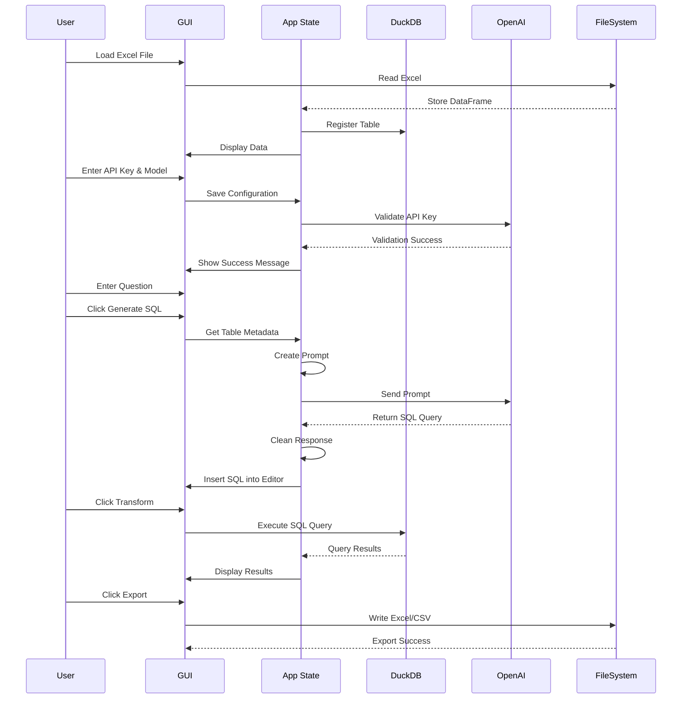
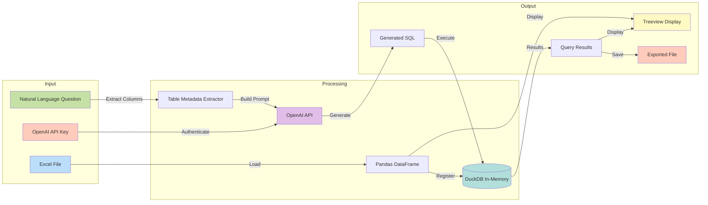

# Excel SQL Transformer - Architecture

## System Architecture

```mermaid
graph TB
    subgraph "User Interface Layer"
        UI[Tkinter GUI]
        LP[Left Panel - Data Display]
        RP[Right Panel - SQL Editor]
        
        LP --> TV[Treeview Widget]
        LP --> SL[Status Label]
        
        RP --> OAI[OpenAI Config Panel]
        RP --> NLQ[Natural Language Query Panel]
        RP --> SQL[SQL Editor]
        RP --> BTN[Action Buttons]
        
        OAI --> APIKEY[API Key Entry]
        OAI --> MODEL[Model Selector]
        OAI --> SAVE[Save Config Button]
        
        NLQ --> QUEST[Question Text Area]
        NLQ --> GEN[Generate SQL Button]
        
        SQL --> SQLTXT[SQL Text Area]
        BTN --> TRANS[Transform Button]
        BTN --> RESET[Reset Button]
        BTN --> EXP[Export Button]
    end
    
    subgraph "Application State"
        STATE[ExcelSQLApp State]
        STATE --> DF[Current DataFrame]
        STATE --> ODF[Original DataFrame]
        STATE --> DUCK[DuckDB Connection]
        STATE --> OAIC[OpenAI Client]
        STATE --> OAIM[OpenAI Model]
        STATE --> OAIK[OpenAI API Key]
    end
    
    subgraph "Data Processing Layer"
        LOAD[Load Excel File]
        TRANS_PROC[Transform Data]
        RESET_PROC[Reset Data]
        EXPORT[Export Results]
        
        LOAD --> PANDAS[Pandas read_excel]
        TRANS_PROC --> DUCKDB[DuckDB Query Engine]
        EXPORT --> WRITER[Excel/CSV Writer]
    end
    
    subgraph "OpenAI Integration Layer"
        CONFIG[Save OpenAI Config]
        GENSQL[Generate SQL from Question]
        META[Get Table Metadata]
        PROMPT[Create OpenAI Prompt]
        
        CONFIG --> VALIDATE[Validate API Key]
        GENSQL --> META
        META --> PROMPT
        PROMPT --> APICALL[OpenAI API Call]
        APICALL --> PARSE[Parse Response]
        PARSE --> CLEAN[Clean SQL Output]
    end
    
    subgraph "External Services"
        EXCEL[Excel Files]
        OPENAI[OpenAI API]
    end
    
    %% User Interactions
    UI -.->|Load File| LOAD
    UI -.->|Configure| CONFIG
    UI -.->|Ask Question| GENSQL
    UI -.->|Execute SQL| TRANS_PROC
    UI -.->|Reset| RESET_PROC
    UI -.->|Export| EXPORT
    
    %% Data Flow
    EXCEL -->|Read| LOAD
    LOAD -->|Store| ODF
    ODF -->|Copy| DF
    ODF -->|Register| DUCK
    
    TRANS_PROC -->|Query| DUCK
    DUCK -->|Results| DF
    DF -->|Display| TV
    
    %% OpenAI Flow
    CONFIG -->|Initialize| OAIC
    GENSQL -->|Use| OAIC
    GENSQL -->|Extract| META
    META -->|Build| PROMPT
    PROMPT -->|Send| OPENAI
    OPENAI -->|Response| CLEAN
    CLEAN -->|Insert| SQLTXT
    
    %% Export Flow
    DF -->|Write| EXPORT
    EXPORT -->|Save| EXCEL
    
    style UI fill:#e1f5ff
    style STATE fill:#fff3e0
    style OPENAI fill:#f3e5f5
    style DUCK fill:#e8f5e9
    style EXCEL fill:#fce4ec
```

## Component Flow Diagram

## Data Flow Architecture

## Key Components

### 1. **User Interface Layer**
- **Left Panel**: Displays data in a Treeview widget with scrollbars
- **Right Panel**: Contains OpenAI configuration, natural language query input, and SQL editor
- **Menu Bar**: File operations (Load, Export, Exit)

### 2. **Application State**
- `df`: Current DataFrame (after transformations)
- `original_df`: Original loaded DataFrame
- `con`: DuckDB in-memory connection
- `openai_client`: OpenAI API client instance
- `openai_model`: Selected OpenAI model
- `openai_api_key`: User's API key

### 3. **Data Processing**
- **Pandas**: Reads Excel files into DataFrames
- **DuckDB**: Executes SQL queries on DataFrames
- **Export**: Writes results to Excel or CSV

### 4. **OpenAI Integration**
- **Configuration**: Validates and stores API credentials
- **Metadata Extraction**: Gets column names and data types
- **Prompt Engineering**: Creates structured prompts with table schema
- **SQL Generation**: Calls OpenAI API and parses responses
- **Response Cleaning**: Removes markdown formatting from generated SQL

## Workflow

### Standard SQL Query Workflow
1. User loads Excel file
2. Data is displayed in Treeview
3. User writes SQL query manually
4. User clicks Transform
5. DuckDB executes query
6. Results are displayed

### AI-Assisted SQL Generation Workflow
1. User loads Excel file
2. User configures OpenAI API key and model
3. User enters natural language question
4. App extracts table metadata (columns, types)
5. App creates prompt with schema + question
6. OpenAI generates SQL query
7. SQL is inserted into editor
8. User can review/modify and execute
9. Results are displayed

## Technology Stack

- **GUI Framework**: Tkinter (Python standard library)
- **Data Processing**: Pandas
- **SQL Engine**: DuckDB (in-memory)
- **AI Integration**: OpenAI API (GPT-4o, GPT-4o-mini, GPT-4-turbo, GPT-3.5-turbo)
- **File I/O**: openpyxl, xlsxwriter
