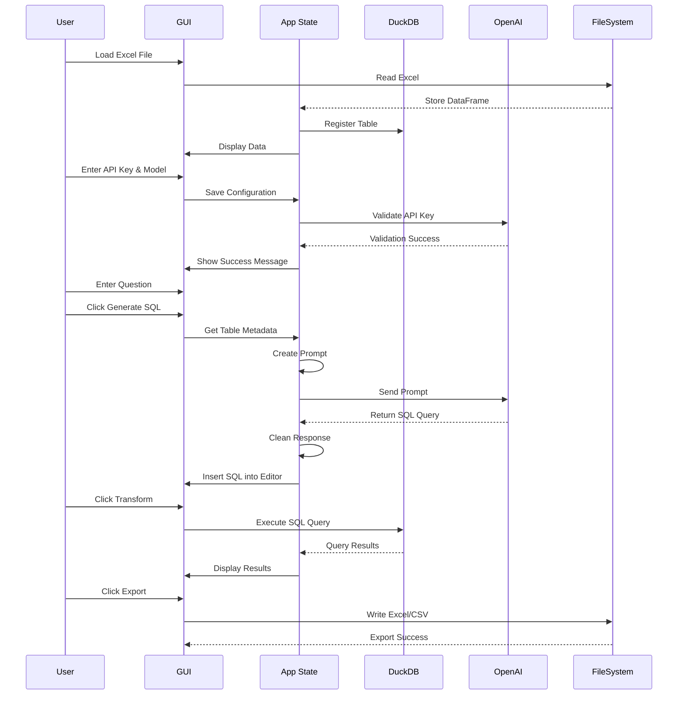

# ExSQL Transformer

A desktop application that allows you to load Excel files, query them using SQL (DuckDB), and generate SQL queries from natural language questions using OpenAI.

## Features

- Load and view Excel files
- Execute SQL queries on Excel data using DuckDB
- Generate SQL from natural language questions (OpenAI integration)
- Export results to Excel or CSV
- Support for latest OpenAI models (GPT-5-mini, GPT-5-nano, GPT-4.1-mini)

## Component Flow Diagram




## Installation

### Prerequisites

- Python 3.12 or higher
- OpenAI API key (for AI-powered SQL generation)

### Setup

1. Clone or download this repository

2. Install dependencies:
```bash
pip install -r requirements.txt
```

## Usage

### Running the Application

```bash
python main.py
```

### Using the Application

1. **Load Excel File**: File → Load Excel File
2. **Configure OpenAI** (optional):
   - Enter your OpenAI API key
   - Select a model
   - Click "Save Configuration"
3. **Generate SQL** (optional):
   - Enter a natural language question about your data
   - Click "Generate SQL"
4. **Execute Query**:
   - Review/edit the SQL in the editor
   - Click "Transform" to execute
5. **Export Results**: Click "Export Results" to save as Excel or CSV

## Creating an Executable

To create a standalone `.exe` file using PyInstaller:

### 1. Install PyInstaller

```bash
pip install pyinstaller
```

### 2. Build the Executable

```bash
pyinstaller --onefile --windowed --name "ExSQL" main.py
```

### 3. Locate the Executable

The `.exe` file will be in the `dist/` folder:
```
dist/ExSQL.exe
```

### PyInstaller Options Explained

- `--onefile`: Creates a single executable file
- `--windowed`: Hides the console window (GUI only)
- `--name`: Sets the executable name

## Technology Stack

- **GUI**: Tkinter
- **Data Processing**: Pandas
- **SQL Engine**: DuckDB (in-memory)
- **AI Integration**: OpenAI API
- **File I/O**: openpyxl, xlsxwriter

## License

MIT
